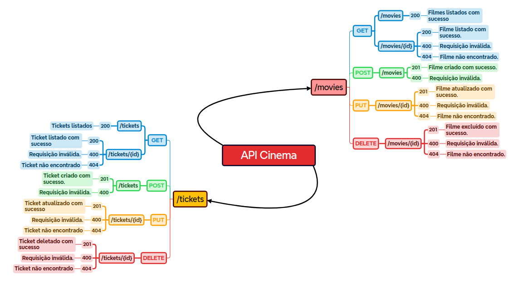

# Challenge Final - Programa de Bolsas Compass.Uol

  

Este repositório é referente aos testes realizados, tanto funcionais quanto não funcionais, na API Cinema a partir das user stories fornecidas e da documentação Swagger da API. A API tem como função realizar operações CRUD (Criar, Ler, Atualizar, Deletar) para filmes e tickets.

[Documentos do Challenge](challengeDocs)  
[Testes do Challenge](k6Testes)

## Navegando pelo Repositório

Para navegar pelos repositórios, siga as instruções abaixo:

## Descrição do Projeto

- **Data de Início:** 19/08/2024
- **Data da Apresentação Final:** 30/08/2024

A organização dos passos necessários foi feita no Jira e também está documentado o relatório de testes executados, se passaram ou não pelos requisitos e métricas estabelecidos, e, no segundo caso, seus respectivos relatórios de bugs.

Utilizando a documentação da API no Swagger, foi criado o seguinte mapa mental para auxiliar na visualização dos status codes e respostas esperadas:

- [Mapa Mental XMind](https://github.com/eduardaldasilva/challengeFinal/blob/main/Assets/API%20Cinema.xmind)
- 

### Histórias de Usuário

- [Movies User Story](challengeDocs/userStories/Movies.md)
- [Tickets User Story](challengeDocs/userStories/Tickets.md)

### Planejamento de Testes

Os testes foram planejados considerando os cenários Funcionais e Não Funcionais:

- [Planejamento de Testes](challengeDocs/planoTestes/planejamentoTestes.md)
- [Plano de Testes Funcionais](challengeDocs/planoTestes/planejamentoFuncional.md)
- [Plano de Testes Não Funcionais](challengeDocs/planoTestes/planejamentoNaoFuncional.md)

### Matriz de Rastreabilidade

Para melhor localização dos Casos de Teste:

- [Matriz de Rastreabilidade](challengeDocs/matrizRastreabilidade.md)

---

## ⚙️ Configuração e Execução dos Testes

### 1. Instale o VS Code

O [Visual Studio Code (VS Code)](https://code.visualstudio.com/) é um editor de código-fonte leve e poderoso. Para instalar:

- **Windows:** Baixe e execute o instalador a partir do site oficial.
- **macOS:** Baixe o instalador e arraste o VS Code para a pasta Aplicativos.
- **Linux:** Use o pacote `.deb` ou o gerenciador de pacotes de sua distribuição.

### 2. Clone o Repositório

Abra o terminal e clone o repositório com o seguinte comando:

```bash
git clone https://github.com/eduardaldasilva/challengeFinal.git
```

Depois, navegue até o diretório do projeto:

```bash
cd k6Testes
```

### 3. Instale o Node.js e npm

Certifique-se de ter o [Node.js](https://nodejs.org) e o npm instalados em sua máquina. Para verificar, execute:

```bash
node -v
npm -v
```

Se necessário, baixe e instale a partir do site oficial.

### 4. Instale o K6

O K6 é uma ferramenta de teste de carga open-source que permite testar o desempenho de suas aplicações e APIs. Para mais informações, consulte a [documentação oficial do K6](https://k6.io/docs/).

Instale o K6 conforme o seu sistema operacional:

- **💻 Para Windows:**

  Utilize o Chocolatey para instalar:

  ```bash
  choco install k6
  ```

- **🐧 Para Linux:**

  Baixe e instale com:

  ```bash
  sudo apt install k6
  ```

- **🍏 Para macOS:**

  Use o Homebrew para instalar:

  ```bash
  brew install k6
  ```

### 5. Abra o Projeto no VS Code

Abra o VS Code e selecione **File > Open Folder**. Navegue até a pasta `k6Testes` que você clonou e abra-a.

### 6. Configure o Ambiente Local

- **📥 Baixe as Informações do Repositório:**

  Clone o repositório da CinemaAPI para o seu computador:

  ```bash
  git clone https://github.com/juniorschmitz/nestjs-cinema.git
  ```

- **🚀 Inicie o CinemaAPI:**

  Certifique-se de que a aplicação CinemaAPI está rodando localmente. No terminal, navegue até o diretório da CinemaAPI e execute:

  ```bash
  npm run start
  ```

  **Nota:** Se você estiver usando a AWS EC2 ou outro ambiente remoto para rodar os testes, verifique se o arquivo de configuração `environment.js` está apontando para a URL da sua instância EC2. Caso contrário, altere a URL para [http://localhost:3000](http://localhost:3000) para testes locais.

### 7. Execute os Scripts de Teste

No terminal integrado do VS Code, execute os testes com K6 usando o seguinte comando:

```bash
k6 run nomeDoTeste.js
```

Substitua `nomeDoTeste.js` pelo nome do script que você deseja executar.

Para gerar o HTML com o relatório dos testes, utilize o próprio recurso de relatório do K6 com o seguinte comando:

```bash
K6_WEB_DASHBOARD=true K6_WEB_DASHBOARD_EXPORT=html-report.html k6 run nomeDoTeste.js
```

Isso criará um arquivo HTML com o relatório dos testes enquanto eles são executados.

---

## 🛠️ Ferramentas Utilizadas

### 🌐 AWS EC2

[AWS EC2](https://aws.amazon.com/ec2/) é um serviço de computação em nuvem que fornece instâncias virtuais para hospedar aplicações e testes. Utilizei a EC2 para rodar os testes de carga e garantir um ambiente de teste consistente. Se você não estiver usando a EC2, ajuste a URL do ambiente para [http://localhost:3000](http://localhost:3000) nos testes locais.

### 💻 Visual Studio Code (VS Code)

[Visual Studio Code (VS Code)](https://code.visualstudio.com/) é um editor de código-fonte leve e poderoso que suporta uma vasta gama de extensões e ferramentas para desenvolvimento. É a principal ferramenta utilizada para escrever e executar scripts de teste.

### 🏷️ Node.js e npm

[Node.js](https://nodejs.org) é um ambiente de execução para JavaScript no lado do servidor, e npm é o seu gerenciador de pacotes. Juntos, eles fornecem um ambiente robusto para executar scripts e gerenciar dependências.

### 🚀 K6

[K6](https://k6.io/docs/) é uma ferramenta de teste de carga open-source que permite realizar testes de desempenho e carga em APIs e aplicações. É a principal ferramenta utilizada para realizar os testes de carga e garantir que a aplicação possa suportar a carga esperada.

### 🧠 XMind

[XMind](https://www.xmind.net/) é uma ferramenta de mapeamento mental que ajuda a organizar ideias e planejar projetos. É utilizada para criar diagramas e fluxogramas que auxiliam na visualização e planejamento dos testes.

### 🌐 JavaScript

[JavaScript](https://developer.mozilla.org/en-US/docs/Web/JavaScript) é uma linguagem de programação amplamente utilizada para desenvolvimento web. É a linguagem principal usada para escrever os scripts de teste no projeto.

---

## Sobre a Autora

**Eduarda Lazzaretti da Silva**

Tenho 20 anos, sou estudante do 3º período de Ciência da Computação na Universidade Federal da Fronteira Sul, Campus Chapecó - SC. Participo do Programa de Bolsas AWS for Software Quality & Test Automation da Compass.Uol desde 06/05/2024. Durante o programa, adquiri muitos conhecimentos em testes e, neste repositório, está documentada uma parte desse aprendizado, com foco em testes realizados no K6.

### Agradecimentos

Por fim, agradeço a Daniela Maffi, Matheus Domingos Locatelli e Luize Carreira Gusmao por nos direcionarem tão bem durante esses últimos meses.

E aos meus colegas, que todos ao seu modo me ajudaram nas dificuldades durante as sprints, deixo aqui um agradecimento final:

Daniel de Queiroz, Ricardo Neckel, Edgar Lutterbach, Kauê Ruchinski, Victoria Valicell, Beatriz Bicalho, Letícia Barbosa, Davi Santana, Gabriel Just, Mathias Fischer, Jorge Carvalho, Isabelle Vimercat, Oliver Almeida, Gabriel Knust, Enzo Rossi, Alline Lopes e Vitor Belger.


